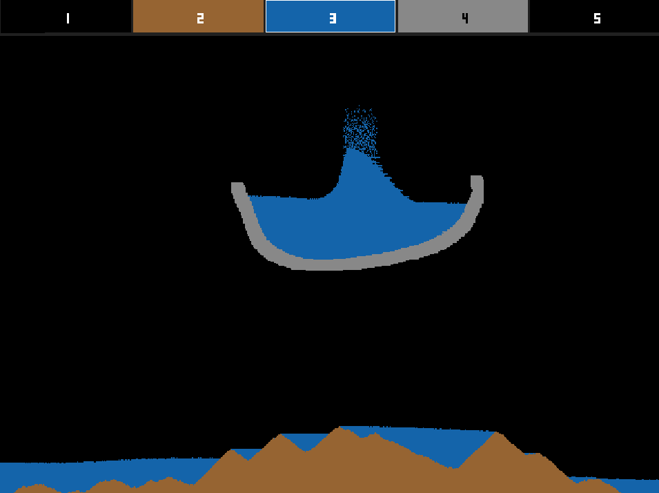

# Sand Simulation Engine

The Sand Simulation Engine is a **real-time particle-based falling sand simulation** written in **C++17**. It simulates granular and fluid materials on a 2D grid, where particles interact according to material-specific physics rules. The simulation runs in a continuous loop, processing user input, updating particle positions based on physics, and rendering the results to an **OpenGL-accelerated** window.

The engine implements a **cellular automata** approach where each grid cell contains a particle with a specific material type. During each simulation step, particles are updated according to their material properties: sand particles exhibit granular behavior (falling and settling), water particles exhibit fluid behavior (flowing horizontally), and stone particles remain static.

Source: [Sand Simulation Engine DeepWiki](https://deepwiki.com/Jailior/sand-simulation-engine/)

#### Example Image:
